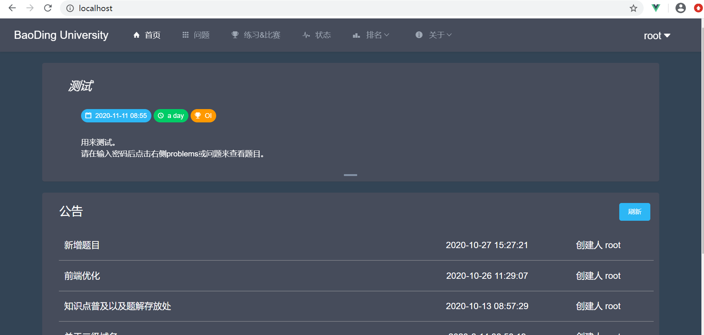

# QDUOJSecondaryDevelopmentFE

**此版本为主题测试版本分支，不建议直接使用。**

**This version is a branch of the theme test version and it is not recommended to use it directly.**

>### A multiple pages app built for OnlineJudge. [Demo](http://oj.xiaoao.space)

## Features

+ Webpack3 multiple pages with bundle size optimization
+ Easy use simditor & Nice codemirror editor
+ Amazing charting and visualization(echarts)
+ User-friendly operation
+ Quite beautiful：)

## Get Started

Install nodejs **v8.12.0** first.

### Linux

```bash
npm install
# we use webpack DllReference to decrease the build time,
# this command only needs execute once unless you upgrade the package in build/webpack.dll.conf.js
export NODE_ENV=development 
npm run build:dll

# the dev-server will set proxy table to your backend
export TARGET=http://Your-backend

# serve with hot reload at localhost:8080
npm run dev
```
### Windows

```bash
npm install
# we use webpack DllReference to decrease the build time,
# this command only needs execute once unless you upgrade the package in build/webpack.dll.conf.js
set NODE_ENV=development 
npm run build:dll

# the dev-server will set proxy table to your backend
set TARGET=http://Your-backend

# serve with hot reload at localhost:8080
npm run dev
```

## Screenshots



## Browser Support

Modern browsers and Internet Explorer 10+.

## LICENSE

[MIT](http://opensource.org/licenses/MIT)
